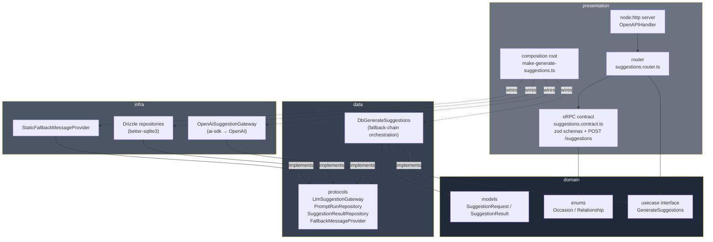
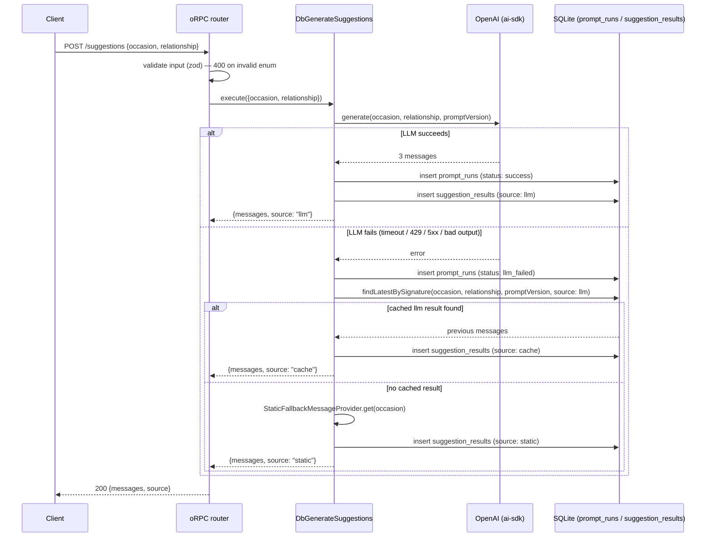

# smash — AI gift-card message suggester

Senior Developer technical test submission. See [`REQUIREMENTS.md`](./REQUIREMENTS.md)
for the original brief.

**Scope of this submission:** the backend (`api/`) only. No Flutter app was
built in this session — see [What wasn't done](#what-wasnt-done-and-why)
below for why, and what the API already provides for a future frontend to
consume.

---

## Table of contents

- [Architecture](#architecture)
- [Request flow / fallback chain](#request-flow--fallback-chain)
- [How to run](#how-to-run)
- [API contract](#api-contract)
- [Decisions and trade-offs](#decisions-and-trade-offs)
- [Quality gate](#quality-gate)
- [What wasn't done, and why](#what-wasnt-done-and-why)
- [How AI was used](#how-ai-was-used)

---

## Architecture

`api/` follows ports-and-adapters (hexagonal/clean architecture), four
layers with a strict one-way dependency rule. Full detail in the root
[`CLAUDE.md`](./CLAUDE.md); summary diagram:



`domain` and `data` know nothing about OpenAI, SQLite, or HTTP — they're
tested with plain in-memory mocks. Swapping the LLM provider or the
database only touches `infra`.

## Request flow / fallback chain

The core business rule: try the LLM; if it fails, try the last thing that
worked for the exact same input; if that doesn't exist either, fall back
to a static, always-safe message. Every attempt is audited, every result
is persisted.



The response is **always `200`** on a well-formed request — the client
never has to special-case an LLM outage, it just gets a `source` field
telling it which stage answered. See
[Decisions and trade-offs](#decisions-and-trade-offs) for what does return
a non-200.

## How to run

Requires Node.js v20+, Bun (package manager/script runner only — the app
itself runs on Node), and an OpenAI API key.

```bash
cd api
bun install
cp .env.example .env        # then fill in OPENAI_API_KEY
bun run db:migrate           # creates ./data/smash.db and applies the schema
bun run dev                   # tsx watch — http://localhost:3000
```

Try it:

```bash
curl -X POST http://localhost:3000/suggestions \
  -H "content-type: application/json" \
  -d '{"occasion":"birthday","relationship":"friend"}'
```

Other useful commands (all from `api/`):

```bash
bun run build            # tsc → dist/
bun run start              # node dist/presentation/http/main.js
bun run typecheck            # tsc --noEmit
bun run lint                   # biome check .
bun run test                     # vitest run
bun run test:coverage              # vitest run --coverage (must be 100%, see QUALITY.md)
```

## API contract

Single endpoint, plain REST/JSON (oRPC contract-first internally, exposed
via `OpenAPIHandler` — no client codegen needed to call it):

**`POST /suggestions`**

```jsonc
// request
{ "occasion": "birthday", "relationship": "friend" }

// response — 200, always, for a well-formed request
{
  "messages": ["...", "...", "..."],
  "source": "llm" // | "cache" | "static"
}
```

`occasion` / `relationship` are closed enums — see
`api/src/domain/enums/`. An invalid value returns `400` with a zod
validation error body; that's the one case this endpoint returns
non-`200`, plus rate limiting (`429`, see below) and an unhandled defect
returning a sanitized generic `500`.

**`GET /spec.json`** — the OpenAPI 3.1 document for the contract above,
generated from the same zod schemas (`@orpc/openapi` + `@orpc/zod/zod4`).
Point a client generator at it to get a typed HTTP client instead of
hand-writing request/response types — e.g.
[Hey API's `openapi-ts`](https://heyapi.dev) with its `orpc` plugin:

```ts
// openapi-ts.config.ts
import { defineConfig } from "@hey-api/openapi-ts";

export default defineConfig({
  input: "http://localhost:3000/spec.json",
  output: "src/client",
  plugins: [{ name: "orpc", validator: { input: "zod" } }],
});
```

## Decisions and trade-offs

**Errors & fallback.** A "failure" is any LLM call that doesn't return a
valid structured response: timeout, 429, 5xx, or output that fails schema
validation — all collapsed into one typed error, because the client
doesn't need to distinguish them, only the fallback chain's behavior
matters. The backend **never** forwards a raw LLM/DB error to the client.
Business failures (LLM/DB) are modeled as values (`Result<T, E>` from
[`better-result`](https://better-result.dev), not exceptions) and always
resolve to a safe `200` through the fallback chain above. The only path
that can return a non-`200` server error is a genuine defect (a bug, not
a modeled failure) — that's allowed to surface as oRPC's own sanitized
generic `500` and gets logged server-side, rather than being silently
disguised as a fake success. Full rationale in `QUALITY.md` → "Error
handling".

**Rate limiting.** **10 requests/minute per IP**, fixed-window, in-memory
(`presentation/http/rate-limiter.ts`), checked before the request reaches
the oRPC handler — a client over the limit never touches the LLM/DB.
Exceeding it returns `429` with `Retry-After` (seconds) and
`{"error":"rate_limited","retryAfterSeconds":n}`. Client IP is taken from
`x-forwarded-for` (first hop) or the raw socket address
(`presentation/http/client-ip.ts`). Configurable via `RATE_LIMIT_MAX` /
`RATE_LIMIT_WINDOW_MS` (defaults `10` / `60000`). Trade-off: fixed-window
can allow up to 2x the limit right across a window boundary, and the
counters live in a single process's memory — fine for one instance, would
need a shared store (e.g. Redis) behind a load balancer.

**Cost control & caching.** Every LLM call is audited in `prompt_runs`
(occasion, relationship, prompt version, model, latency, status) — that's
the mechanism to actually measure and control spend, not a guess. The
model is the cheapest OpenAI chat model suitable for short structured
text (`gpt-5-nano` by default, configurable via `OPENAI_MODEL` — worth
re-checking against OpenAI's current pricing before relying on it).
Caching in this test is **result-as-fallback**, not a request-time cache:
a successful LLM answer for a given `occasion`+`relationship`+prompt
version is reused only when a *later* call to the LLM fails, not to skip
calling the LLM on a normal repeat request — the brief asks for LLM
*suggestions* per request, and always serving a canned cached answer for
a repeat input would defeat that. In production, I'd add a genuine
short-TTL request-time cache (same key) to cut cost further, plus
consider batching/prompt-compression once volume justifies it.

**Prompt versioning.** Templates live in code
(`api/src/infra/llm/prompts/`), each with a `PROMPT_VERSION` string
persisted on every DB row. This lets cost/quality be tracked per template
version, and stops the cache-fallback layer from ever serving an answer
generated by a prompt template that's since changed.

## Quality gate

This backend was built largely by an AI coding agent — see
[QUALITY.md](./QUALITY.md) and [quality-gates.json](./quality-gates.json)
for the gate that was set up specifically to compensate for that: 100%
statement/branch/function/line coverage (vitest + v8), enforced per-layer
with the appropriate test type (unit/integration/component/e2e — see
`QUALITY.md` for the taxonomy), plus Biome for lint/format. Currently
green: `bun run typecheck`, `bun run lint`, and `bun run test:coverage`
all pass.

## What wasn't done, and why

The brief asks for a Flutter app consuming this API. It wasn't built in
this session — the work here was scoped, in the actual conversation that
produced it, to "build an API" with a specific architecture and quality
bar (ports-and-adapters, `better-result`, Drizzle+SQLite, a 100%-coverage
gate); the Flutter half was never part of the ask. What's in place to
make that follow-up straightforward:

- a plain REST/JSON endpoint (no client codegen needed from Dart);
- a documented, stable contract (`occasion`/`relationship` enums →
  `{messages, source}`), plus a generated OpenAPI document at
  `GET /spec.json` for typed-client codegen (TS/JS consumers);
- loading/success/error states are fully representable client-side from
  the response shape alone (`source` distinguishes a genuine LLM answer
  from a fallback, and any non-`200` is a real client-facing error).

Also not implemented, explicitly optional in the brief: a genuine
request-time cache (see trade-offs above for why, and what a production
version would add). Rate limiting *is* implemented — see above.

## How AI was used

This entire backend — architecture, code, tests, and this documentation
set — was built by an AI coding agent (Claude, via Claude Code) working
from explicit direction rather than an open-ended "build the test." The
human author (Vinícius) specified, upfront: Node v20 runtime with Bun as
package manager, ports-and-adapters with exactly the
`domain/data/infra/presentation` layer split, oRPC for the API layer
(contract-first, exposed as plain REST), `better-result` instead of raw
`try`/`catch` for all fallible operations, Drizzle + SQLite with prompt
versioning and full audit persistence as the second fallback layer, and a
100%-coverage quality gate with test types matched to each layer —
then, mid-build, corrected the transport choice (oRPC, not Hono) and
added the `better-result` and Biome requirements as follow-ups.

Within that brief, the agent made and is responsible for: the exact
fallback-chain implementation (`data/usecases/db-generate-suggestions.ts`,
including the decision to use explicit `Result.isOk`/`Result.match`
branching instead of `Result.gen`'s short-circuit composition, since the
chain needs to keep going after an `Err`, not stop); the DB schema and
migrations; the `better-result` API usage patterns (verified against the
library's own shipped type definitions and README, not assumed from
memory); the ai-sdk integration (`generateText` + `Output.object`,
verified against the installed package's types since the API had changed
since training — `generateObject` is deprecated in the installed
version); test design and the specific mocking strategy per layer
(`MockLanguageModelV4` for the OpenAI adapter, a faked
`LlmSuggestionGateway` port for e2e — see `QUALITY.md` for why); and all
of this documentation, including the architecture diagrams above. Where
the agent was materially uncertain (runtime/test-runner choice, REST vs
RPC transport shape, "cheapest OpenAI model" at the time of building),
it asked rather than guessed. Every dependency's actual API surface
(oRPC, ai-sdk, `better-result`) was checked against the installed
package's own type definitions and/or official docs before being used,
rather than relied on from pretraining — several real mismatches were
caught and fixed this way (e.g. `generateObject`'s deprecation, oRPC's
exact contract/implement/OpenAPIHandler API, `better-result`'s
`Result.tryPromise`/`Result.gen`/`TaggedError` signatures).
