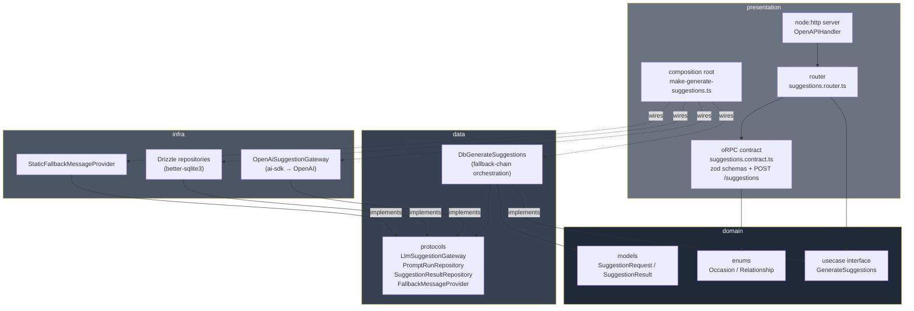
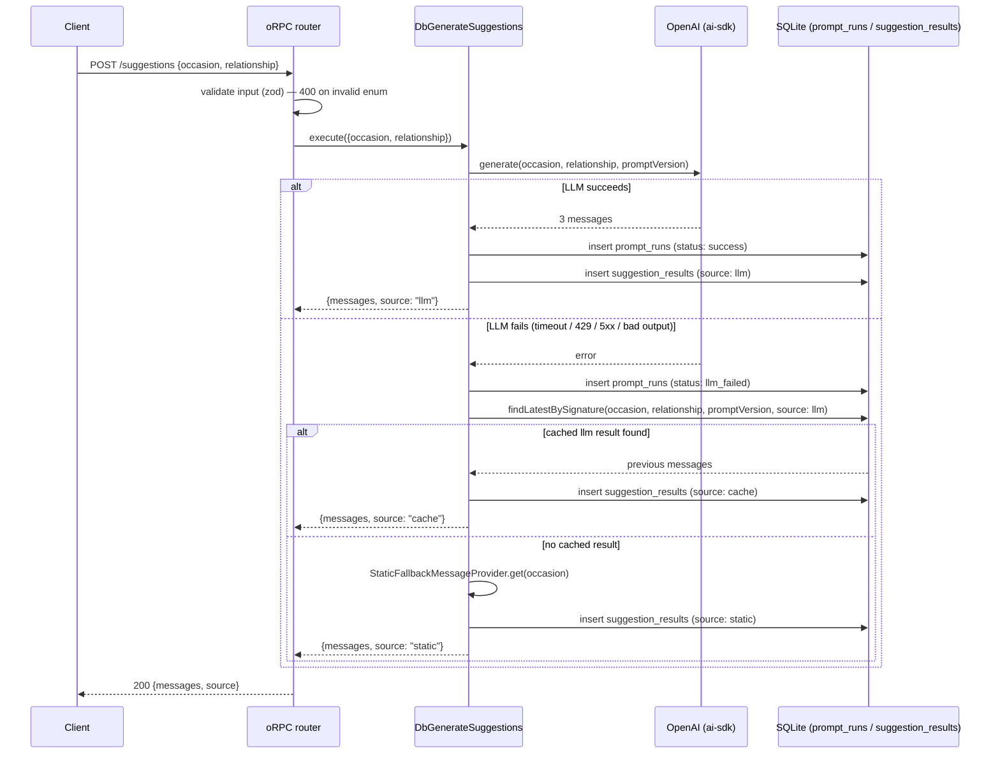
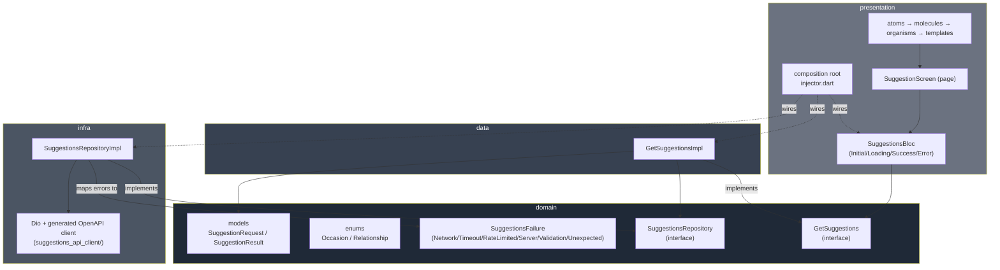

# smash — AI gift-card message suggester

Senior Developer technical test submission. See [`REQUIREMENTS.md`](./REQUIREMENTS.md)
for the original brief.

**Scope of this submission:** a backend (`api/`) and a Flutter app
(`app/`) that consumes it, per [`REQUIREMENTS.md`](./REQUIREMENTS.md).

---

## Table of contents

- [Architecture](#architecture)
- [Request flow / fallback chain](#request-flow--fallback-chain)
- [How to run](#how-to-run)
- [API contract](#api-contract)
- [Decisions and trade-offs](#decisions-and-trade-offs)
- [Quality gate](#quality-gate)
- [Flutter app (`app/`)](#flutter-app-app)
  - [How to run](#how-to-run-1)
- [What wasn't done, and why](#what-wasnt-done-and-why)
- [How AI was used](#how-ai-was-used)

---

## Architecture

`api/` follows ports-and-adapters (hexagonal/clean architecture), four
layers with a strict one-way dependency rule. Full detail in the root
[`CLAUDE.md`](./CLAUDE.md); summary diagram:



`domain` and `data` know nothing about OpenAI, SQLite, or HTTP — they're
tested with plain in-memory mocks. Swapping the LLM provider or the
database only touches `infra`.

## Request flow / fallback chain

The core business rule: try the LLM; if it fails, try the last thing that
worked for the exact same input; if that doesn't exist either, fall back
to a static, always-safe message. Every attempt is audited, every result
is persisted.



The response is **always `200`** on a well-formed request — the client
never has to special-case an LLM outage, it just gets a `source` field
telling it which stage answered. See
[Decisions and trade-offs](#decisions-and-trade-offs) for what does return
a non-200.

## How to run

Requires Node.js v20+, Bun (package manager/script runner only — the app
itself runs on Node), and an OpenAI API key.

```bash
cd api
bun install
cp .env.example .env        # then fill in OPENAI_API_KEY
bun run db:migrate           # creates ./data/smash.db and applies the schema
bun run dev                   # tsx watch — http://localhost:3000
```

Try it:

```bash
curl -X POST http://localhost:3000/suggestions \
  -H "content-type: application/json" \
  -d '{"occasion":"birthday","relationship":"friend"}'
```

Other useful commands (all from `api/`):

```bash
bun run build            # tsc → dist/
bun run start              # node dist/presentation/http/main.js
bun run typecheck            # tsc --noEmit
bun run lint                   # biome check .
bun run test                     # vitest run
bun run test:coverage              # vitest run --coverage (must be 100%, see QUALITY.md)
```

That's the backend on its own (the `curl` above is enough to exercise the
whole fallback chain). To run the **full stack** — Flutter app talking to
this backend — leave this running and follow
[Flutter app (`app/`) → How to run](#how-to-run-1).

## API contract

Single endpoint, plain REST/JSON (oRPC contract-first internally, exposed
via `OpenAPIHandler` — no client codegen needed to call it):

**`POST /suggestions`**

```jsonc
// request
{ "occasion": "birthday", "relationship": "friend" }

// response — 200, always, for a well-formed request
{
  "messages": ["...", "...", "..."],
  "source": "llm" // | "cache" | "static"
}
```

`occasion` / `relationship` are closed enums — see
`api/src/domain/enums/`. An invalid value returns `400` with a zod
validation error body; that's the one case this endpoint returns
non-`200`, plus rate limiting (`429`, see below) and an unhandled defect
returning a sanitized generic `500`.

**`GET /spec.json`** — the OpenAPI 3.1 document for the contract above,
generated from the same zod schemas (`@orpc/openapi` + `@orpc/zod/zod4`).
Point a client generator at it to get a typed HTTP client instead of
hand-writing request/response types — e.g.
[Hey API's `openapi-ts`](https://heyapi.dev) with its `orpc` plugin:

```ts
// openapi-ts.config.ts
import { defineConfig } from "@hey-api/openapi-ts";

export default defineConfig({
  input: "http://localhost:3000/spec.json",
  output: "src/client",
  plugins: [{ name: "orpc", validator: { input: "zod" } }],
});
```

## Decisions and trade-offs

**Errors & fallback.** A "failure" is any LLM call that doesn't return a
valid structured response: timeout, 429, 5xx, or output that fails schema
validation — all collapsed into one typed error, because the client
doesn't need to distinguish them, only the fallback chain's behavior
matters. The backend **never** forwards a raw LLM/DB error to the client.
Business failures (LLM/DB) are modeled as values (`Result<T, E>` from
[`better-result`](https://better-result.dev), not exceptions) and always
resolve to a safe `200` through the fallback chain above. The only path
that can return a non-`200` server error is a genuine defect (a bug, not
a modeled failure) — that's allowed to surface as oRPC's own sanitized
generic `500` and gets logged server-side, rather than being silently
disguised as a fake success. Full rationale in `QUALITY.md` → "Error
handling".

**Rate limiting.** **10 requests/minute per IP**, fixed-window, in-memory
(`presentation/http/rate-limiter.ts`), checked before the request reaches
the oRPC handler — a client over the limit never touches the LLM/DB.
Exceeding it returns `429` with `Retry-After` (seconds) and
`{"error":"rate_limited","retryAfterSeconds":n}`. Client IP is taken from
`x-forwarded-for` (first hop) or the raw socket address
(`presentation/http/client-ip.ts`). Configurable via `RATE_LIMIT_MAX` /
`RATE_LIMIT_WINDOW_MS` (defaults `10` / `60000`). Trade-off: fixed-window
can allow up to 2x the limit right across a window boundary, and the
counters live in a single process's memory — fine for one instance, would
need a shared store (e.g. Redis) behind a load balancer.

**Cost control & caching.** Every LLM call is audited in `prompt_runs`
(occasion, relationship, prompt version, model, latency, status, **and
`cost_usd`**) — that's the mechanism to actually measure and control
spend, not a guess. `cost_usd` is computed per call from
`generateText`'s reported `usage.inputTokens`/`usage.outputTokens`
against a hardcoded $/1M-token table in `infra/llm/pricing.ts`
(verified against OpenAI's own pricing page — $0.05/1M input,
$0.40/1M output for `gpt-5-nano`, checked 2026-08-11), `null` for calls
that failed (nothing to price) or use a model not yet in that table —
it's a point-in-time snapshot, not fetched live, so it needs updating
whenever `OPENAI_MODEL` changes or OpenAI reprices. The model itself is
the cheapest OpenAI chat model suitable for short structured text
(`gpt-5-nano` by default, configurable via `OPENAI_MODEL`).
Caching in this test is **result-as-fallback**, not a request-time cache:
a successful LLM answer for a given `occasion`+`relationship`+prompt
version is reused only when a *later* call to the LLM fails, not to skip
calling the LLM on a normal repeat request — the brief asks for LLM
*suggestions* per request, and always serving a canned cached answer for
a repeat input would defeat that. In production, I'd add a genuine
short-TTL request-time cache (same key) to cut cost further, plus
consider batching/prompt-compression once volume justifies it.

**Prompt versioning.** Templates live in code
(`api/src/infra/llm/prompts/`), each with a `PROMPT_VERSION` string
persisted on every DB row. This lets cost/quality be tracked per template
version, and stops the cache-fallback layer from ever serving an answer
generated by a prompt template that's since changed.

**CORS.** `presentation/http/server.ts` sends a permissive
`Access-Control-Allow-Origin: *` (plus `Methods`/`Headers`) on every
response and answers `OPTIONS` preflights with `204` — needed because the
Flutter app's **web** build runs as an in-browser `fetch`/XHR client
(unlike its mobile/desktop builds, which aren't subject to CORS), and the
oRPC/`node:http` server didn't handle preflights at all before this. `*`
is a deliberate trade-off for a local test API with no cookies/auth
headers involved; a real deployment would allowlist known origins instead.
Covered by an e2e test (both the preflight response and the header on a
normal response).

## Quality gate

This backend was built largely by an AI coding agent — see
[QUALITY.md](./QUALITY.md) and [quality-gates.json](./quality-gates.json)
for the gate that was set up specifically to compensate for that: 100%
statement/branch/function/line coverage (vitest + v8), enforced per-layer
with the appropriate test type (unit/integration/component/e2e — see
`QUALITY.md` for the taxonomy), plus Biome for lint/format. Currently
green: `bun run typecheck`, `bun run lint`, and `bun run test:coverage`
all pass.

## Flutter app (`app/`)

Same ports-and-adapters split as the backend (`domain ← data ← infra`;
`presentation` depends on `domain`/`data` and wires everything via a
composition root), plus the **bloc pattern** for state and **atomic
design** for widgets. `fpdart`'s `Either`/`TaskEither` replace
try/catch throughout — every fallible operation (the one network call)
returns a `TaskEither<SuggestionsFailure, SuggestionResult>` instead of
throwing, chained with `.map`/`.match` instead of nested try/catch.



**Network client: generated, not hand-written.** `app/openapi/spec.json`
is a committed copy of the backend's `GET /spec.json`; `lib/infra/network/
openapi_codegen.dart` (an `@Openapi(...)` annotation) drives
[`openapi_generator`](https://pub.dev/packages/openapi_generator) (the
`dart-dio` generator) to produce a standalone, **gitignored** package at
`app/suggestions_api_client/` — a Dio-based client + `built_value` models.
One deliberate edit to the committed spec copy: the response's `messages`
field is a zod tuple (`z.tuple([string,string,string])`), which OpenAPI
3.1 expresses as `prefixItems` — the bundled `openapi-generator-cli`
doesn't understand that keyword and silently degrades the field to
`BuiltList<JsonObject?>`. The committed copy uses the equivalent
`items: {type: "string"}, minItems: 3, maxItems: 3` instead, which
generates the correct `BuiltList<String>`. Full regen steps are in the
codegen file's header comment.

**Custom failures, scoped per context.** `SuggestionsFailure` (sealed:
`NetworkFailure`, `TimeoutFailure`, `RateLimitedFailure`, `ServerFailure`,
`ValidationFailure`, `UnexpectedFailure`) is mapped once, at
`infra/repositories/suggestions_repository_impl.dart`, from
`DioException`/HTTP status codes — the only place in the app that knows
Dio exists. One hierarchy because the app has one integration point
(the suggestions API); a second feature would get its own
`<feature>_failure.dart` rather than cases bolted onto this one.

**Atomic design.** `presentation/widgets/{atoms,molecules,organisms,
templates}/` + `presentation/screens/` (pages). Atoms are dumb
(`AppButton`, `AppDropdown<T>`, `MessageCard`, `LoadingIndicator`, no
domain types); molecules add labels/domain typing (`OccasionField`,
`RelationshipField`, `ErrorBanner` — the one place that turns a
`SuggestionsFailure` into user-facing copy); organisms compose molecules
into a section (`SuggestionForm`, `SuggestionsList`); the template
(`SuggestionScreenTemplate`) is layout-only, no state. `SuggestionScreen`
is the only widget that touches `SuggestionsBloc`.

**Design system.** [`app/DESIGN.md`](./app/DESIGN.md) is the token spec —
a dark, high-contrast palette with a single indigo accent, adapted from a
reference dashboard screenshot the human author provided (only the
*visual language* — palette, type scale, spacing, radii, component
treatment, empty-state pattern — not that screenshot's unrelated sidebar
nav, since this app is one screen). Implemented with
[`mix`](https://fluttermix.com) (`lib/presentation/theme/`): `ColorToken`/
`SpaceToken`/`RadiusToken`/`TextStyleToken` maps feed a `MixThemeData`,
wired app-wide via `MixTheme` in `MaterialApp.builder` (`main.dart`), plus
a matching dark Material `ThemeData` for the couple of stock widgets that
have no `mix` equivalent (`Scaffold`, `AppBar`,
`DropdownButtonFormField`). Custom atoms (`AppButton`, `MessageCard`, the
template's panel) are built on `mix`'s `Box`/`StyledText`/`PressableBox`
against those tokens instead of ad-hoc `Container`/`Text`/`Color`s. One
non-obvious gotcha: widget tests need their own `MixTheme` ancestor in
`pumpWidget` — `main.dart`'s wiring doesn't reach them — or every
`mix`-styled widget throws `No MixTheme found in context`.

### How to run

Requires Flutter 3.38+ (bundled Dart 3.10+) and Java (used by the bundled
`openapi-generator-cli` for client codegen — already required once, not
at every build).

```bash
cd app
flutter pub get
flutter pub run build_runner build --delete-conflicting-outputs  # generates suggestions_api_client/
flutter run --dart-define=API_BASE_URL=http://localhost:3000       # or your device's reachable host
```

The backend (`api/`, see [How to run](#how-to-run) above) must be running
at that URL. `API_BASE_URL` defaults to `http://localhost:3000` — on a
physical device or emulator that can't reach `localhost` on the host
machine, pass the host's LAN IP or (Android emulator) `10.0.2.2` instead.

To run the **web** build specifically (the app is device-agnostic —
`flutter devices` lists whichever targets are available locally, e.g.
`chrome`/`macos`/an iOS simulator):

```bash
flutter run -d chrome --dart-define=API_BASE_URL=http://localhost:3000
```

The backend must be reachable *and* CORS-enabled for this (see
[Decisions and trade-offs](#decisions-and-trade-offs) → "CORS") — already
the default in `api/`'s server, no extra setup needed.

Regenerate the client whenever the backend contract changes: re-export
`api/`'s `GET /spec.json` into `app/openapi/spec.json` (adjust the
`messages` field as above), then rerun the `build_runner` command.

```bash
flutter analyze   # 0 issues
flutter test       # 14 tests: data/usecases, infra/repositories, presentation/blocs, presentation/screens
```

## What wasn't done, and why

Not implemented, explicitly optional in the brief: a genuine
request-time cache on the backend (see trade-offs above for why, and
what a production version would add) — rate limiting *is* implemented.
No CI workflow is wired up for either `api/` or `app/` yet
(`quality-gates.json` documents what CI *should* run for the backend).
No deployed URL — the brief says local run instructions are enough.

## How AI was used

This entire backend — architecture, code, tests, and this documentation
set — was built by an AI coding agent (Claude, via Claude Code) working
from explicit direction rather than an open-ended "build the test." The
human author (Vinícius) specified, upfront: Node v20 runtime with Bun as
package manager, ports-and-adapters with exactly the
`domain/data/infra/presentation` layer split, oRPC for the API layer
(contract-first, exposed as plain REST), `better-result` instead of raw
`try`/`catch` for all fallible operations, Drizzle + SQLite with prompt
versioning and full audit persistence as the second fallback layer, and a
100%-coverage quality gate with test types matched to each layer —
then, mid-build, corrected the transport choice (oRPC, not Hono) and
added the `better-result` and Biome requirements as follow-ups.

Within that brief, the agent made and is responsible for: the exact
fallback-chain implementation (`data/usecases/db-generate-suggestions.ts`,
including the decision to use explicit `Result.isOk`/`Result.match`
branching instead of `Result.gen`'s short-circuit composition, since the
chain needs to keep going after an `Err`, not stop); the DB schema and
migrations; the `better-result` API usage patterns (verified against the
library's own shipped type definitions and README, not assumed from
memory); the ai-sdk integration (`generateText` + `Output.object`,
verified against the installed package's types since the API had changed
since training — `generateObject` is deprecated in the installed
version); test design and the specific mocking strategy per layer
(`MockLanguageModelV4` for the OpenAI adapter, a faked
`LlmSuggestionGateway` port for e2e — see `QUALITY.md` for why); and all
of this documentation, including the architecture diagrams above. Where
the agent was materially uncertain (runtime/test-runner choice, REST vs
RPC transport shape, "cheapest OpenAI model" at the time of building),
it asked rather than guessed. Every dependency's actual API surface
(oRPC, ai-sdk, `better-result`) was checked against the installed
package's own type definitions and/or official docs before being used,
rather than relied on from pretraining — several real mismatches were
caught and fixed this way (e.g. `generateObject`'s deprecation, oRPC's
exact contract/implement/OpenAPIHandler API, `better-result`'s
`Result.tryPromise`/`Result.gen`/`TaggedError` signatures).

The Flutter app (`app/`) was built the same way, in a later session, from
equally explicit direction: bloc pattern, repositories/usecases,
`domain/data/infra/presentation` layering mirroring the backend,
`fpdart`'s `Either`/`TaskEither` instead of try/catch, custom failure
types scoped per context, a network client generated from the backend's
OpenAPI spec (not hand-written), and atomic design for the widget tree —
each specified upfront or added as an explicit follow-up before
implementation started (plan reviewed and approved before any code was
written). Within that brief, the agent made and is responsible for: the
exact package/generator choice (`openapi_generator`'s `dart-dio`
generator, chosen over Swagger-2-oriented pure-Dart alternatives for
OpenAPI 3.1 support); discovering and fixing the `prefixItems`
codegen gap (verified by inspecting the actual generated model, not
assumed); the `SuggestionsFailure` taxonomy and where each `DioException`
type/status code maps to it; the manual composition-root/DI approach
(no DI package, matching the backend's style); and all test design
(`bloc_test` state-sequence tests, `mocktail`-mocked repository/usecase,
a widget test per bloc state).

Two follow-up rounds after the initial build, both human-directed:

1. **Bug reports, agent-diagnosed.** "Web can't reach the backend" turned
   out to be two real issues, not one — the backend never answered CORS
   preflights (browsers only; the app's mobile/desktop builds were never
   affected), and separately its dev database hadn't been migrated this
   session, so persistence was silently failing (masked by the fallback
   chain still returning `200`, per its documented design above). Fixed
   both, added e2e coverage for the CORS preflight. A second report — "a
   duplicated loading indicator" — was the submit button's own busy
   spinner and a redundant standalone one both rendering for
   `SuggestionsLoading`; removed the redundant one and added a regression
   widget test asserting exactly one spinner.
2. **Design system.** Given a reference screenshot (a dark dashboard UI)
   and told to use [`mix`](https://fluttermix.com) for the style guide,
   the agent: wrote `app/DESIGN.md` translating the screenshot into
   concrete tokens (deliberately scoping out that screenshot's unrelated
   sidebar nav, since this app is one screen — see the file for the
   reasoning); verified `mix`'s actual API against the version pub
   actually resolved (`1.7.0` — a `2.x` exists, but this project's Dart
   SDK constraint blocks it, and `2.x`'s API differs meaningfully from
   `1.x`, so training-data familiarity with "mix" could easily have
   produced code against the wrong major version) by reading the
   installed package's source directly; and restyled the existing atoms
   onto it.
